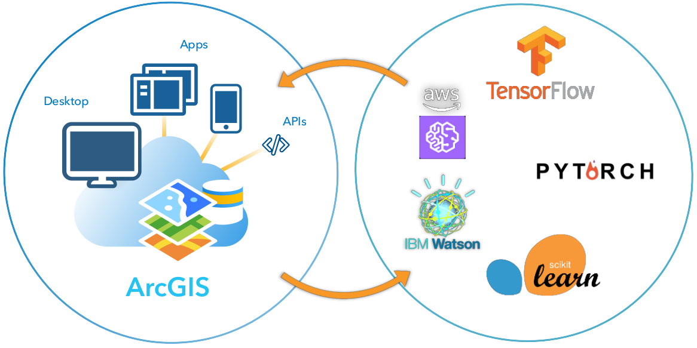
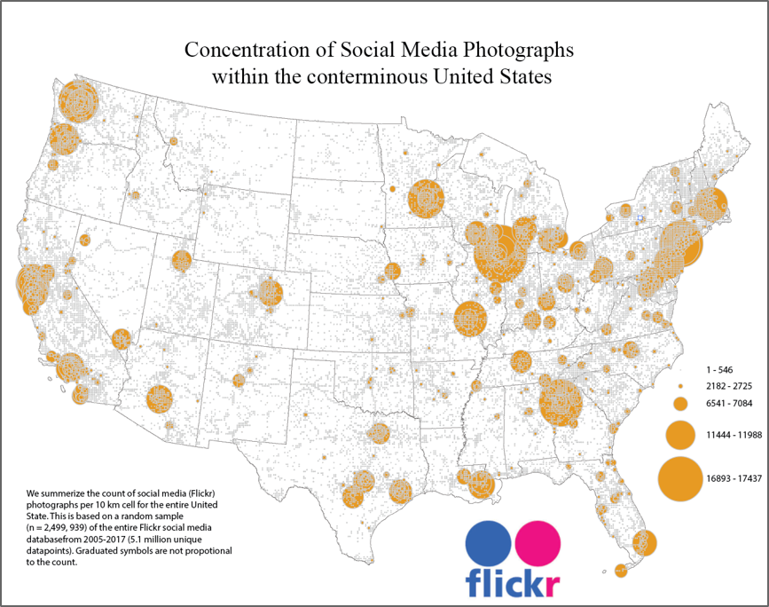
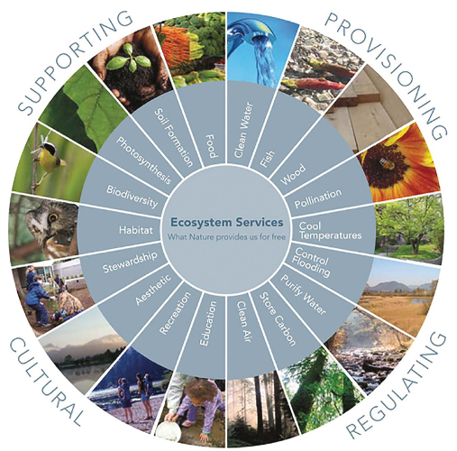
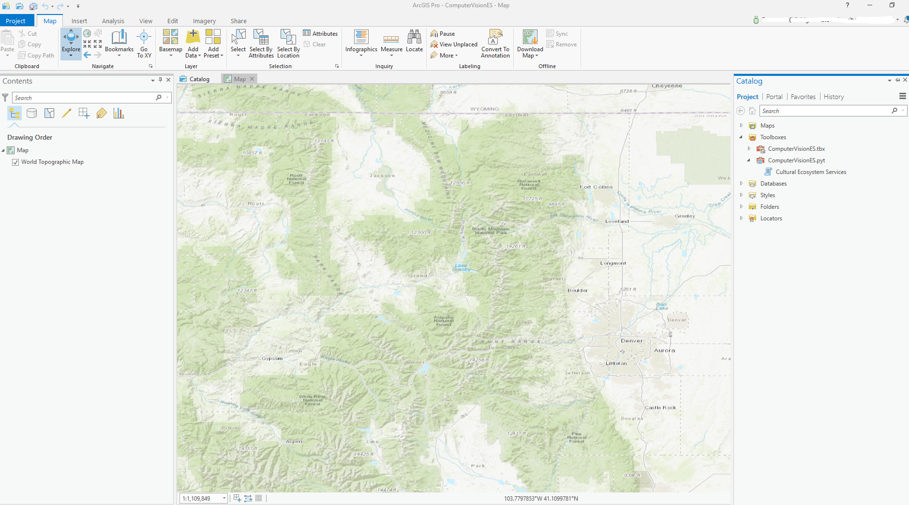
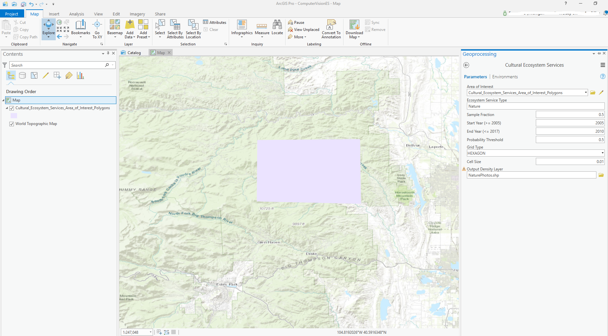
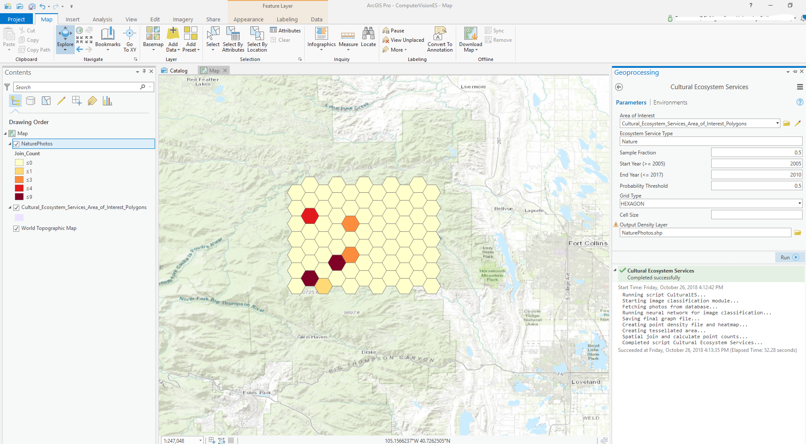
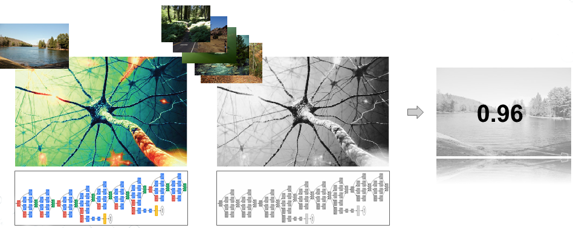

# Deep Learning: CNNs for Classification of Cultural Ecosystem Services

*figure credits: ESRI*

This repository contains all the code, files, and documentation needed to run our Python deep learning toolbox for ArcGIS Pro --a GUI-based tool to extract user-uploaded photos from a 2005-2017 [Flickr](https://www.flickr.com/) database and predict density of nature-based photos using a trained [Convolutional Neural Network (CNN)](http://cs231n.github.io/convolutional-networks/) model with [TensorFlow](https://www.tensorflow.org/tutorials/images/image_recognition). The CNN used here is based off Google's own [Inception-v3](https://arxiv.org/abs/1512.00567) model. 

## Flickr Photos Storage:

The photo database used with our tool and packed into the [`flickrDB_small_mod.parq`](https://drive.google.com/file/d/1_tuEaSMwuJ8rA0anYt7slcOBOnXCcVrQ/view?usp=sharing) parquet file for efficient storing has been compiled by making use of the [Flickr API](https://www.flickr.com/services/api/) and selecting only photos for the USA lower 48 states going from 2005 up to 2017.

**Disclaimer: All data dowloaded from Flickr and stored in a local database has been stripped of any type of user identifier and is therefore anonymous. Our algorithm only uses dates and geospatial locations specified by the user when uploading the photos.**

## Cultural Ecosystem Services:

The [Ecosystem Services & Biodiversity (ESB)](http://www.fao.org/ecosystem-services-biodiversity/background/cultural-services/en/) definition of **cultural ecosystem services** says:

> The non-material benefits people obtain from ecosystems are called ‘cultural services'. They include aesthetic inspiration, cultural identity, sense of home, and spiritual experience related to the natural environment. Typically, opportunities for tourism and for recreation are also considered within the group. Cultural services are deeply interconnected with each other and often connected to provisioning and regulating services: Small scale fishing is not only about food and income, but also about fishers’ way of life. In many situations, cultural services are among the most important values people associate with Nature – it is therefore critical to understand them.

Our tool helps users understand which areas have the highest concentration of cultural ecosystem services or the non-material benefits of Nature and therefore identify locations of high recreational, inspiration, aesthetics and spiritual value.

## Python Conda Environment Setup:

**NOTE: this tool has been developed and successfully tested within ESRI's ArcGIS Pro 2.2. We cannot guaranteed that the tool works with previous versions of the software. Please follow our instructions below to make sure the Python environment is correctly set up with all the necessary modules for deep learning we used.**

In order to make it easier for users to replicate our own Python development environment, we created a YML file (see *environment.yml*) to be used with [Conda](https://conda.io/docs/) and have all the necessary libraries. If you have ArcGIS Pro 2.2+ installed on your system, then Conda is already installed inside the ArcGIS local folder structure. Since the default conda environment used by ArcGIS Pro 2.2+ cannot be altered, you need to follow these steps to create a new environment off of our YML file and then set it up as the default ArcGIS Pro environment. Do not worry, you are not overriding the original environment, so you can always switch it back to the default one. Our environment is a clone of all the default ArcGIS Pro libraries, plus several more needed to run deep learning and image processing with our tool.

1. Open the command line prompt and navigate to the following folder:

    `cd C:\Program Files\ArcGIS\Pro\bin\Python\Scripts`

2. Type `activate` and press Enter. You now activated the default (root) conda environment.

3. Create a new conda environment using our YML file with the following command:

    `conda env create -f *<PATH_TO_YML_FILE>*`

    where *<PATH_TO_YML_FILE>* corresponds to the location where you downloaded and unzipped (or cloned) this Github repository. **You need to point to the environment.yml file contained in our folder**.

4. Follow the instructions and appear on the command line while the new environment is created and respond yes (y) anytime conda asks you to install new libraries.

5. You can now check the existing environments by typing `conda env list` and make sure the new one was created successfully. You should see the default `arcgispro-py3` environment, as well as the new `deep-learning-arcgispro-py3` environment created from our YML file.

6. Type the following command and press Enter to activate an environment for the current and all future sessions of ArcGIS Pro and "Python Command Prompt"

    `proswap %LocalAppData%\ESRI\conda\envs\deep-learning-arcgispro-py3`

    **NOTE: if you ever want to switch back to the default ArcGIS Pro 2.2+ environment, type:**

    `proswap arcgispro-py3`

7. Download the [`flickrDB_small_mod.parq`](https://drive.google.com/file/d/1_tuEaSMwuJ8rA0anYt7slcOBOnXCcVrQ/view?usp=sharing) photo database file and make sure to store it inside the main unzipped folder (or cloned) for this repository. If you skip this step, the tool will not work!.

You are now all set to open ArcGIS Pro and add our Python toolbox to start using it!! If you encounter any errors or get stuck during the previous steps, please reach out to us via email for technical help or open a new Github issue directly in this repository.

## Python Toolbox: Graphical User Interface (v1.0a --> alpha stage, unstable)

Add our Python Toolbox (.pyt) called **ComputerVisionES** to the Geoprocessing tools and double-click on it to find the *Cultural Ecosystem Services* script tool in it.

Draw an area of interest over a basemap (make sure you are using geographic coordinate system for you ArcGIS Pro project) and fill out the mandatory parameters. Then click Run to execute the tool.

Once the tool is done running (execution time may significantly vary based on your selected extent and parameter values) you should see the new gridded feature class in the table of content panel. Pick a symbology to represent the `joint_count` attribute and visualize the photo densities for each grid cell.

## Convolutional Neural Network

As stated in the introduction, we re-trained a [Convolutional Neural Network (CNN)](http://cs231n.github.io/convolutional-networks/) model based off Google's own [Inception-v3](https://arxiv.org/abs/1512.00567) model. We used the [TensorFlow](https://www.tensorflow.org/tutorials/images/image_recognition) framework and related Python libraries to code the portion of the script that runs the CNN model to classify **Nature** vs. **Urban** photos, using natural landscapes as a proxy for cultural ecosystem services.

The following shows a schematic representation of the CNN and the final output probability that comes out of the algorithm. The probability threshold parameter in our tool, controls above which probability value an image should be classified as **Nature**.

[*figure credits*](https://www.researchgate.net/figure/The-Millennium-Ecosystem-Assessment-MEA-organizes-ecosystem-services-into-four-broad_fig3_267623726) 

## Credits and Contacts

Francesco Tonini: <ftonini84@gmail.com>
Derek Van Berkel: <derekvanberkel@gmail.com>

## LICENSE

[Apache 2.0](LICENSE)